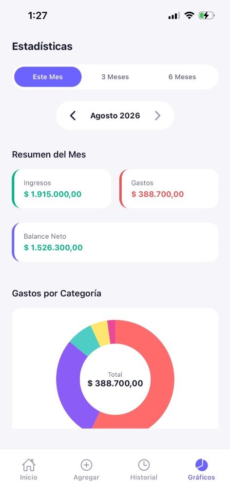

# 💰 Guita — App Nativa de Finanzas Personales & AI Advisor

[](https://reactnative.dev/)
[](https://expo.dev/)
[](https://www.typescriptlang.org/)
[](LICENSE)

**Guita** es una aplicación móvil nativa (iOS & Android) diseñada para el control inteligente de finanzas personales, gestión de presupuestos, metas de ahorro y monitoreo del mercado cambiario en Argentina.

Construida bajo estándares de arquitectura limpia, **Guita** combina rendimiento nativo, almacenamiento híbrido seguro (SQLite local + AsyncStorage fallback), biometría de hardware y generación de reportes ejecutivos en PDF.

---

## 📱 Galería de Capturas (Screenshots)

| Pantalla de Bloqueo / Onboarding | Dashboard Principal | Reportes & Gráficos |
| :---: | :---: | :---: |
|  |  |  |

*(Sugerencia: Colocá tus capturas de pantalla en la carpeta `./assets/screenshots/`)*

---

## 🔥 Características Destacadas

- 🔒 **Seguridad Biometric Gate & PIN Numérico**:
  - Autenticación biométrica de hardware con **Face ID** / **Touch ID** (`expo-local-authentication`).
  - Teclado numérico táctil de 4 dígitos con animación de vibración háptica en PIN erróneo.

- 💵 **Cotización del Dólar en Tiempo Real**:
  - Integración en vivo con API financiera (`dolarapi.com`) para consultar **Dólar Blue** y **Dólar Oficial**.
  - **Conversor instantáneo ARS ↔ USD**: Alterná la visualización de tu balance completo de Pesos a Dólares con un toque.

- 🤖 **Guita AI Advisor**:
  - Asistente financiero inteligente que analiza la relación Ingresos vs. Gastos y genera recomendaciones de ahorro personalizadas.

- 🎯 **Widget de Meta de Ahorro Personalizable**:
  - Seguimiento de objetivos financieros (ej: *Fondo de Emergencia*, *Vacaciones*) con barra de progreso animada y edición rápida.

- 📄 **Generador de Reportes PDF Corporativos**:
  - Exportación de documentos PDF ejecutivos (`expo-print`) con diseño de calidad bancaria, gradientes, resúmenes de saldo y tablas de movimientos.
  - Exportación complementaria a formato CSV estructurado con codificación UTF-8 BOM para Microsoft Excel.

- 💳 **Planificador de Cuotas Fijas**:
  - Selección de gastos en **1, 3, 6 o 12 cuotas fijas** con cálculo de la cuota mensual en tiempo real.

- 🍞 **UI Human Touch & Feedback Sensorial**:
  - Notificaciones flotantes animadas tipo **Toast Banner** con glassmorphic styling.
  - **Skeleton Loaders** con pulso de brillo animado durante la carga de datos.
  - Personalización de Avatar Emoji (🚀, 🦊, ⚡, 👑, 💼, 💎, 🦁, 🦄, 🔮, 💸).

- 🔔 **Notificaciones Push Diarias**:
  - Recordatorio automático diario programado nativamente en el celular a las **21:00 hs**.

- 📊 **Análisis Temporal Acumulado**:
  - Gráficos donut y ranking top de categorías con filtro por **Este Mes**, **Últimos 3 Meses** o **6 Meses Acumulados (Marzo - Agosto 2026)**.

---

## 🛠️ Stack Tecnológico

| Tecnología | Descripción |
| :--- | :--- |
| **Framework** | [React Native](https://reactnative.dev/) + [Expo SDK 54](https://expo.dev/) |
| **Routing** | [Expo Router](https://docs.expo.dev/router/introduction/) (File-based navigation) |
| **Lenguaje** | [TypeScript](https://www.typescriptlang.org/) (Strict type checking) |
| **Base de Datos** | [expo-sqlite](https://docs.expo.dev/versions/latest/sdk/sqlite/) (iOS/Android) + `AsyncStorage` (Web) |
| **PDF & Printing** | [expo-print](https://docs.expo.dev/versions/latest/sdk/print/) + `expo-sharing` |
| **Gráficos** | [react-native-gifted-charts](https://github.com/Abhinandan-Kushwaha/react-native-gifted-charts) |
| **Biometría** | [expo-local-authentication](https://docs.expo.dev/versions/latest/sdk/local-authentication/) |
| **Notificaciones** | [expo-notifications](https://docs.expo.dev/versions/latest/sdk/notifications/) |
| **Feedback Háptico** | [expo-haptics](https://docs.expo.dev/versions/latest/sdk/haptics/) |

---

## 🚀 Instalación y Ejecución Local

### Prerrequisitos
- Node.js (v18+)
- npm / yarn / pnpm
- Aplicación **Expo Go** en tu dispositivo móvil (iOS / Android)

### Pasos
1. **Clonar el repositorio**:
   ```bash
   git clone https://github.com/<tu-usuario>/guita.git
   cd guita
   ```

2. **Instalar dependencias**:
   ```bash
   npm install
   ```

3. **Iniciar el servidor de desarrollo Expo**:
   ```bash
   npx expo start
   ```

4. **Ejecutar en tu dispositivo**:
   - Escaneá el código QR desde la app **Expo Go** o Safari (`exp://<tu-ip>:8081`).

---

## 📜 Licencia

Este proyecto está bajo la Licencia MIT. Podés usarlo libremente para aprendizaje, portfolio personal o desarrollo profesional.

Desarrollado con ❤️ por **Aguss** 🚀
